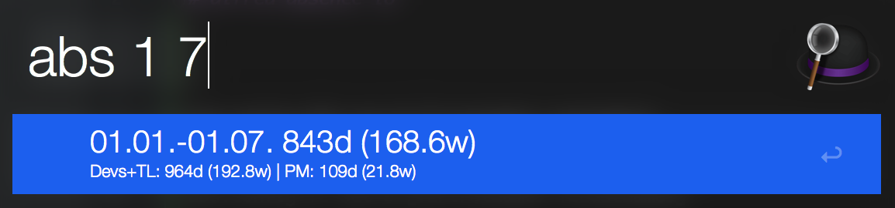

[](https://travis-ci.org/dpeuscher/alfred-absence-io)[](https://codecov.io/gh/dpeuscher/alfred-absence-io)
# alfred-absence-io

Show the developer capacity from january to july:


### config
```
abs:config DEV set 0 [Firstname1 Lastname1]
abs:config DEV set 0 [Firstname2 Lastname2]

abs:config TL set 0 [TLFirstname1 TLLastname1]

abs:config PM set 0 [PMFirstname1 PMLastname1]

abs:config LOCATION set [Location]

abs:config ABSENCEID set [absence API id]
abs:config ABSENCEKEY set [absence API key]
```
Every [Firstname Lastname] combination is a user identified by their first and last name like in absence.io

DEV is the list of developers
TL is the list of teamleads
PM is the list of product managers

LOCATION is the location in which the team works (e.g. München)

ABSENCEID and ABSENCEKEY can be obtained in the absence.io login area "Profile" -> "Integrations" -> "Generate API Key"

ABSENCEENDPOINT can also be configured. It might change but for now it can stay on https://app.absence.io/api/v2/ 